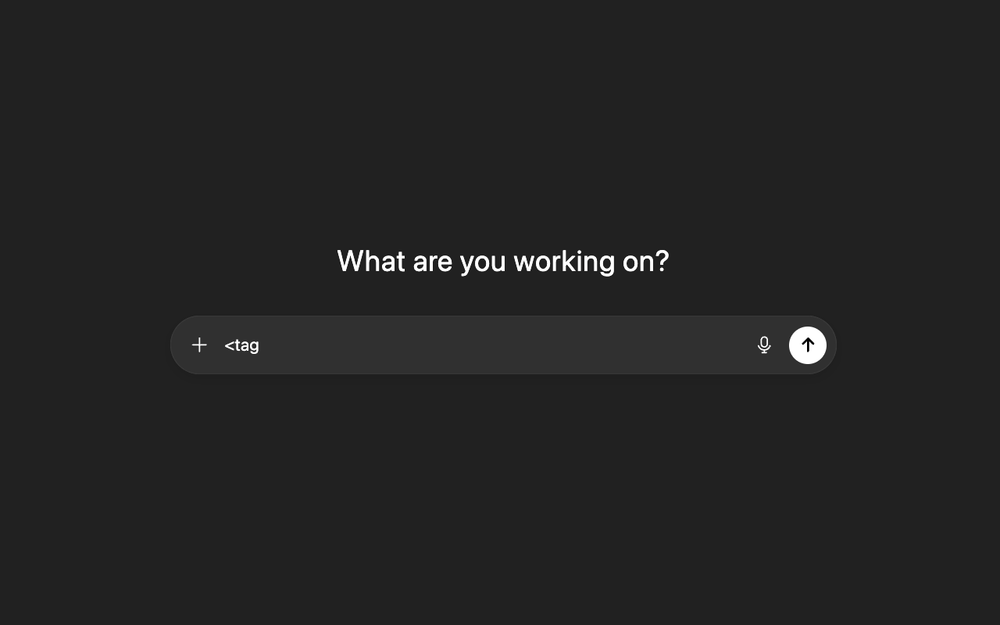
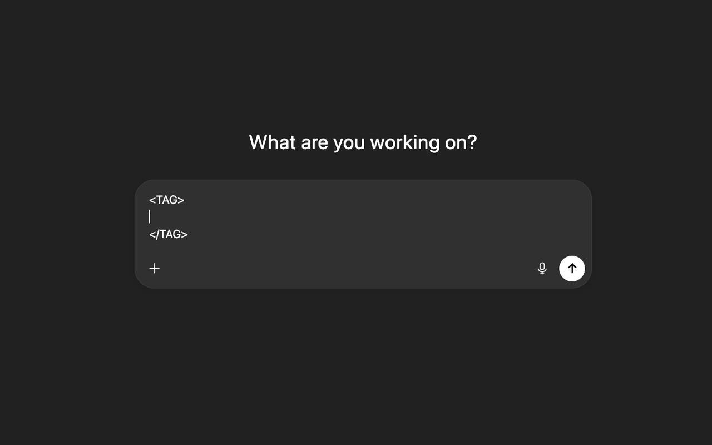

# Auto Close Tag for ChatGPT
> ⚠️ **Note:** This Chrome Extension is currently under review

  

A **Google Chrome Extension** that automatically completes `</tag>` while typing prompts.  
It is an assistant tool for structuring prompt creation.

---

## 📌 What it does

XML-like section structures such as `<instruction_spec>` can improve GPT-5’s adherence to instructions.  
Using sections helps add context and reduce ambiguity.

---

## ✨ Key Features

- Auto-close for `<tag>`
- Options (enabled by default): automatic line breaks between opening/closing tags
- Options (enabled by default): capitalization of English tag names
- Auto-inserts closing tags even when attributes like `<tag id="">` are present
- Pair deletion: pressing **Backspace** removes the matching `</tag>`
- Does not auto-complete for **VOID tags** (`br`, `img`, etc.) or while IME conversion is active

---

## 🖼️ Example

Before typing:

  

After typing (closing tag is automatically inserted):

  

---

## 🚀 How to Use

1. Install the extension and open **ChatGPT**  
2. Type `<tag>` and the closing tag (`</tag>`) will be inserted automatically  
3. On first use, auto line breaks and capitalization of tag text are applied (can be disabled in extension options)

---

## ⚠️ Limitations

- Works only on **ChatGPT’s unified composer**  
- Does not work in the address bar, Chrome Web Store, or inside other extensions

---

## 📚 References

- [OpenAI “GPT-5 for Coding Cheatsheet”](https://cdn.openai.com/API/docs/gpt-5-for-coding-cheatsheet.pdf)  
  Recommends structuring instructions with XML-like syntax.

- [OpenAI “GPT-5 Prompting Guide”](https://cookbook.openai.com/examples/gpt-5/gpt-5_prompting_guide)  
  Explains structured prompting and insights from Cursor.